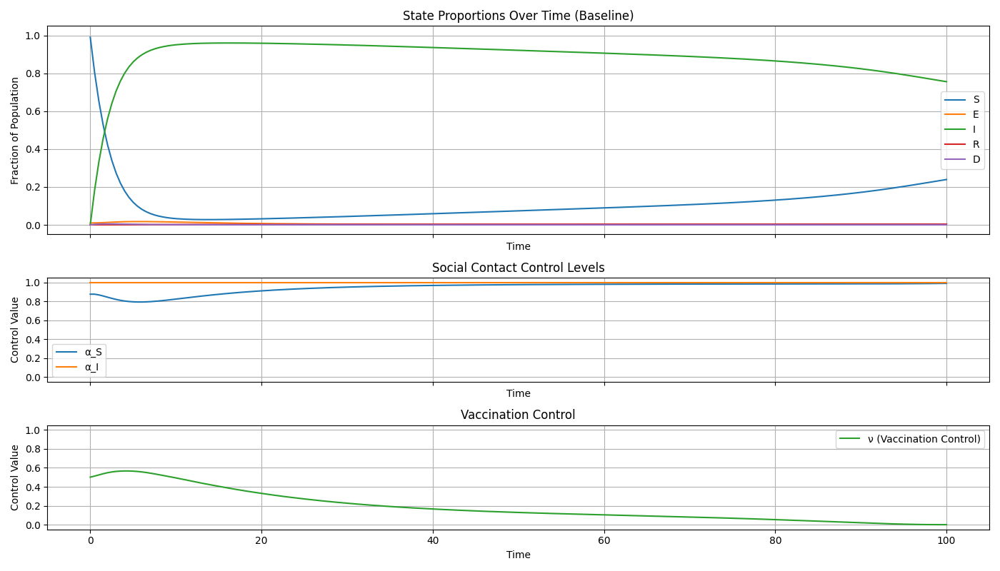
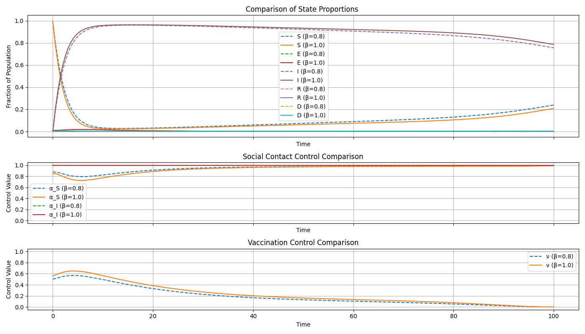
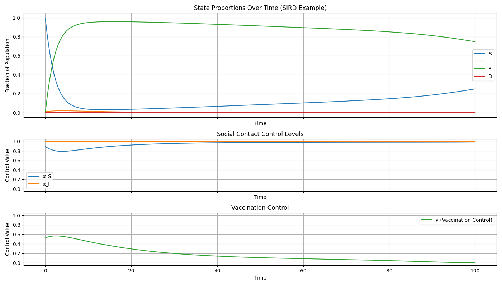

# SEIRD/SIRD Plotting Examples

This document provides **example usage** and **instructions** for plotting and comparing SEIRD/SIRD epidemic simulations using the functions:

- `plot_evolution(results, setup, epi)`  
- `compare_settings(results1, results2, setup)`  

These functions integrate with the `simulateEQ_contact_rate()` solver to visualize epidemic dynamics, social contact controls, and vaccination policies.

---

## 1. Setup and Imports

```python
import numpy as np
from SEIRD import (
    simulateEQ_contact_rate,
    SimulationSetup,
    EpidemicParams,
    CostParams,
    ControlParams,
)
from plot_epidemic_controls import plot_evolution, compare_settings
```

---

## 2. Example: Single SEIRD Simulation

We simulate a standard SEIRD model with one block, 200 time steps, and moderate infection rate.

```python
# Simulation setup
n_blocks = 1
Nt = 200
T = 100
t_grid = np.linspace(0, T, Nt)
p_0 = np.array([0.99, 0.01, 0, 0, 0])  # S, E, I, R, D

setup = SimulationSetup(
    n_blocks=n_blocks,
    n_states=5,
    Nt=Nt,
    T=T,
    t_grid=t_grid,
    graphon=np.ones((n_blocks, n_blocks)),
    block_dens=np.ones(n_blocks),
    p_0=p_0,
    u_T=np.zeros(5 * n_blocks),
    death=True,
    exposed=True,
    epsilon=1e-5,
)

# Parameters
epi = EpidemicParams(beta=0.8, gamma=0.1, rho=0.1, chi=0.7, kappa=0.8, eta=0.01)
cost = CostParams(c_lambda=0.1, c_inf=0.3, c_dead=0.5, c_nu=0.1)
ctrl = ControlParams(
    lambda_type=0,
    lambda_duration=None,
    lambda_s_in=np.array([0.99]),
    lambda_e_in=np.array([0.71]),
    lambda_i_in=np.array([1.0]),
    lambda_r_in=np.array([1.0]),
)

# Run simulation
results = simulateEQ_contact_rate(setup, epi, cost, ctrl)

# Plot dynamics
plot_evolution(results, setup, epi, title_suffix="(SEIRD Example)")
```

**Output:**

- Top: State trajectories for S, E, I, R, D
- Middle: Social contact controls $( \alpha_S, \alpha_I )$
- Bottom: Vaccination control $( \nu )$

---

## 3. Example: Comparison Between Two Scenarios

Here we compare a baseline simulation $( \beta = 0.8 )$ with a high-transmission case $(\beta = 1.0)$.

```python
from copy import deepcopy

epi_base = EpidemicParams(beta=0.8, gamma=0.1, rho=0.1, chi=0.7, kappa=0.8, eta=0.01)
epi_high = deepcopy(epi_base)
epi_high.beta = 1.0  # Increased infection rate

results_base = simulateEQ_contact_rate(setup, epi_base, cost, ctrl)
results_high = simulateEQ_contact_rate(setup, epi_high, cost, ctrl)

compare_settings(results_base, results_high, setup, label1="beta=0.8", label2="beta=1.0")
```

**Output:**

- Overlaid plots comparing infection curves, contact control levels, and vaccination intensity.

---

## 4. Example: SIRD Case

```python
setup_SIRD = SimulationSetup(
    n_blocks=1,
    n_states=4,
    Nt=200,
    T=100,
    t_grid=np.linspace(0, 100, 200),
    graphon=np.ones((1, 1)),
    block_dens=np.ones(1),
    p_0=np.array([0.99, 0.01, 0.0, 0.0]),
    u_T=np.zeros(4),
    death=True,
    exposed=False,
    epsilon=1e-5,
)

epi_SIRD = EpidemicParams(beta=0.7, gamma=0.1, rho=0.05, chi=0.0, kappa=0.8, eta=0.01)
results_SIRD = simulateEQ_contact_rate(setup_SIRD, epi_SIRD, cost, ctrl)
plot_evolution(results_SIRD, setup_SIRD, epi_SIRD, title_suffix="(SIRD Example)")
```

This automatically suppresses the E-state and adjusts all plots accordingly.

**Output:**


---

## 6. Notes

- These plotting functions are agnostic to model type (SEIRD or SIRD).
- `compare_settings()` is useful for policy experiments (e.g., different control costs or infection rates).
- You can easily extend the code to compute summary metrics (peak infection time, cumulative deaths, etc.).

